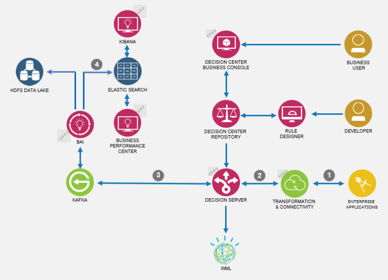
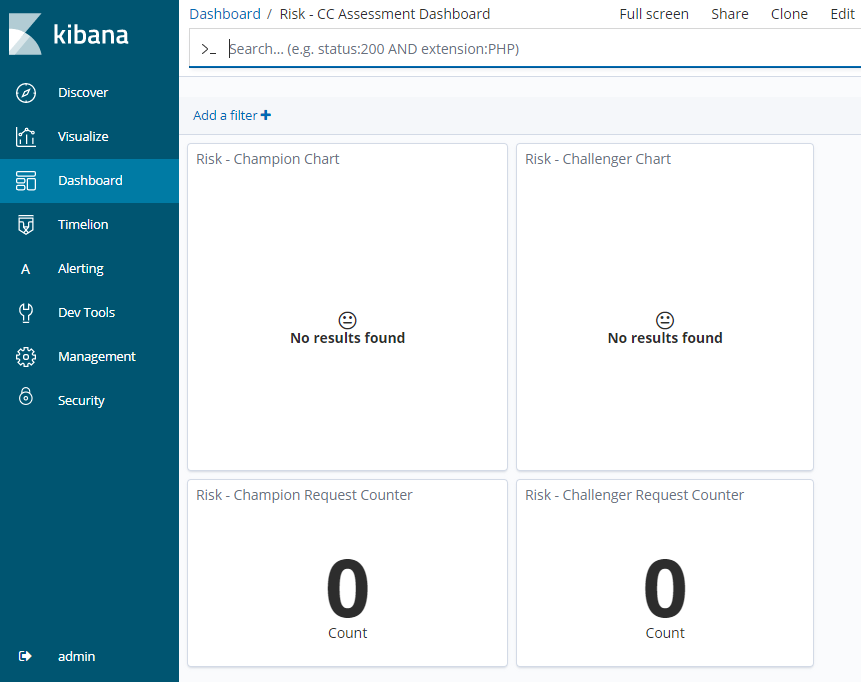
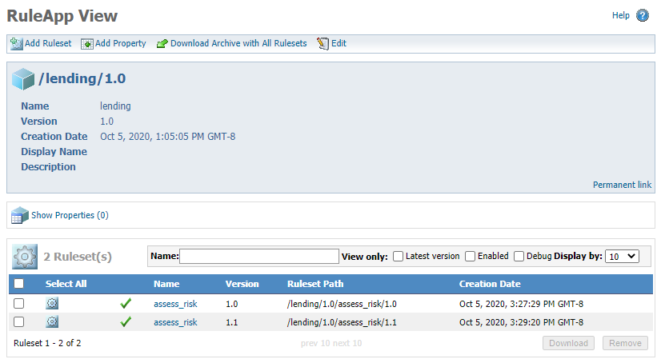
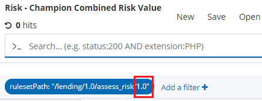
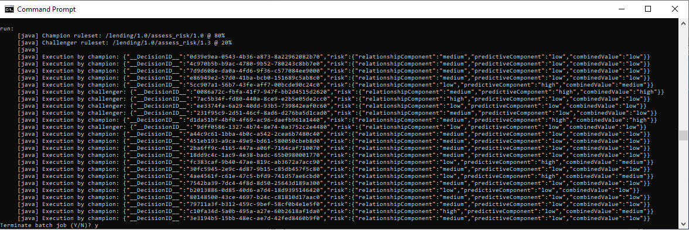
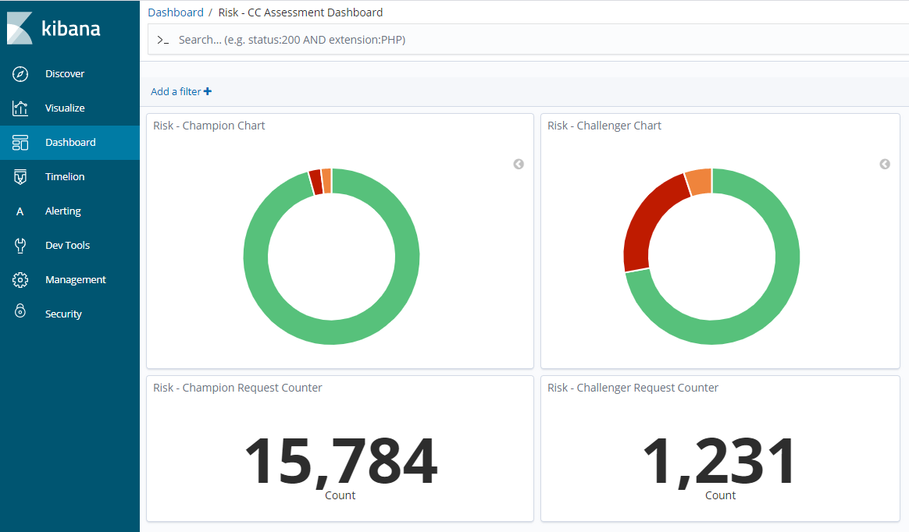

Champion/challenger is a common decision-proofing practice in the banking and lending industries. It is very similar in principle to A/B testing, and is performed in a *production environment*.

The *champion* is the current version of the decision deployed in production. The *challenger* is the new version of the decision that will also be deployed in production to be tested against the champion. When the decision is called, a portion (usually a majority) of the traffic will be routed to the champion, and the remainder to the challenger.

The goal is then to capture execution details for both versions and compare them using the desired KPIs. The actual implementation of the routing depends on the application integration approach that you want to use. With the containerized version of ODM, there is no out-of-the-box approach to manage this routing within the scope of the Rule Execution Server; in particular, the Ruleset Interceptor approach is not available for containerized deployments. 

## How does BAI help?

From a monitoring and analytics point of view, the [IBM Business Automation Insights](https://www.ibm.com/support/knowledgecenter/SSYHZ8_20.0.x/com.ibm.dba.bai/topics/con_bai_overview_top.html) (BAI) component capabilities is an obvious candidate to support the champion/challenger practice requirements. BAI provides instant feedback on the champion and challenger behavior through dashboards. It then provides the ability to perform more complex segmentation and analysis based on the decision trace from each request execution by working on the business events that it collects in a data lake.

The ODM and BAI component architecture is shown on the figure below. The champion/challenger flow across these components is the follwoing:
1. The enterprise client application invokes the ODM decision service without specifying a service version number.
2. The connectivity component manages the routing of the traffic to the champion or challenger decision service.
3. The business events from the decision service execution are published to a Kafka queue and routed to the BAI component.
4. BAI sends the timeseries events to Elasticsearch so that they can be filtered and displayed side by side in a Kibana dashboard.

## Check it out for yourself!

### Load the predefined Kibana dashboard
- Log-in to the Kibana console and click the `Management` tab.
- Select the `Import` link to import the pre-configured `bai-export - champion/challenger-dashboard.json` dashboard found in the [export](https://github.com/ibm-cloud-architecture/odm-cp4d-integration/tree/master/data/exports) folder. This will import the dashboard, visualization and query objects for Kibana. All these objects are prefixed with `Risk -` so you can find them easily from the Search  field.

In the `Dashboard` tab of the Kibana console, you can search for the `Risk - CC Assessment Dashboard` dashboard and open it. The empty dashboard will look like this:

### Deploy a champion and a challenger ruleset
You need at least 2 versions of the same ruleset to experiment.
- From `risk-assessment-main` decision service in Decision Center, start by deploying a first version of the `assess_risk` ruleset that will be the considered as champion.
- Create a branch of the decision service, modify some of the rules, for example the `final risk` decision table, in order to change the output of the decision, then deploy this second version of `assess_risk` to the Rule Execution Server (RES).

You should now have 2 versions of the same ruleset deployed to the RES, as shown below:

Note that the provided Kibana queries and visualizations are filtering events for version 1.0 and 2.0 of the `assess_risk` ruleset. If you plan on using  different version numbers, you will need to update the queries and visualizations definitions with the appropriate ruleset version number.
The screenshot below shows an example of where you would have to update the version number for the queries:

### Generate requests to the decision service
A number of predefined JSON request payloads for the `assess_risk` decision are defined in the `scenarios.json` file in the [champion-challenger](https://github.com/ibm-cloud-architecture/odm-cp4d-integration/tree/master/data/champion-challenger) folder.
To invoke these requests, you can use the `send-requests.bat|sh` script located in the [tools](https://github.com/ibm-cloud-architecture/odm-cp4d-integration/tree/master/hierarchical-model/tools) Java project, with 3 parameters:
- the champion ruleset path
- the challenger ruleset path
- The percent of calls routed to the champion

For example, use the command `send-requests /lending/1.0/assess_risk/1.0 /lending/1.0/assess_risk/1.1 80`. You will an output similar to this:

### Watch the Kibana dashboard
Make sure to adjust the Kibana time range to a short, recent period (e.g. last 15 minutes) and watch the Kibana dashboard evolve. It will show you the number of requests for champion and challenger and the distribution of risks for each, similar to this:

