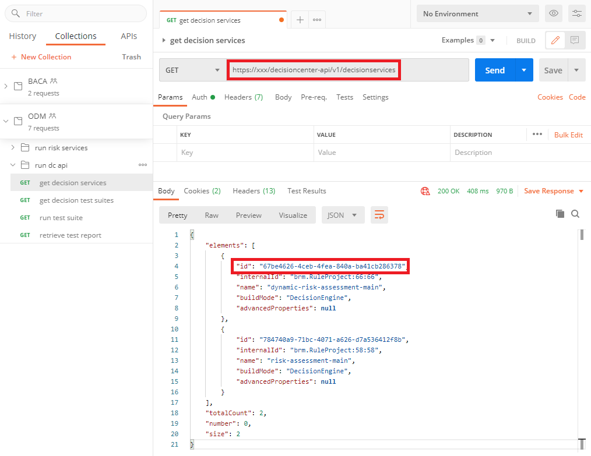
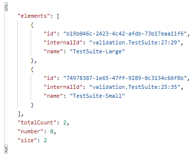
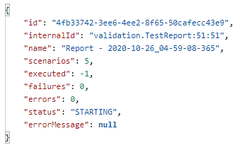
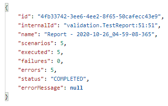

<InlineNotification kind="warning">
<strong>Updated 10/26/2020</strong> - Work in progress
</InlineNotification>

Continuous integration and continuous deployment for ODM can be supported through the use of the Decision Center REST API.

The documentation for this API is found [here](https://www.ibm.com/support/knowledgecenter/SSQP76_8.10.x/com.ibm.odm.dcenter.ref.dc/topics/dc-swagger-cloud.json).
The core REST resources used for CI/CD purpose are listed under the *Build* section:
- `/v1/testsuites/{testSuiteId}/run`: allows to run a test suite on Decision Center.
- `/v1/deployments/{deploymentId}/deploy`: allows to deploy a RuleApp to a Decision Server runtime.

Other resources under the `Explore` section allow to explore and select the desired `{testSuiteId}` or `{deploymentId}`.

## Try it!
You can quickly explore the DecisionCenter REST API from a tool such as Postman. Let's try for example to run an ODM test suite that has been previosuly defined .

- In order to designate the test suite you want to run, you need the id of the test suite. So, you start by querying the existing decision services using the `/v1/decisionservices` resource, as shown below:

- You can then use the id from the desired decision service to retrieve the list of test suites for the decision service using the `/v1/decisionservices/{decisionServiceId}/testsuites` resource (alternatively, if you want to exercise a test suite on s specific branch or release, you can first query for the list of branches of the decision service by using the `/v1/decisionservices/{decisionServiceId}/branches` resource and use the branch id to retrieve the associated test suites). The test suites are then listed:

- Say you want to execute the `TestSuite-Small` test suite. You can now use the `/v1/testsuites/{testSuiteId}/run` resource using id `74978387-1e65-47ff-9289-0c3134c66f8b`. The result of this request is the following:

- After the test suite execution has started, you can retrieve the status using the resource `/v1/testreports/{testReportId}`, which will provide the following information:

In this case, we see that the execution has completed, has run 5 scenarios and, unfortunately in this case, all scenarios have ended up in error.

Based on the above sequence, you can see how to integrate calls to the Decision Center REST API with your CI/CD pipeline to automate build, test and deployment operations.

