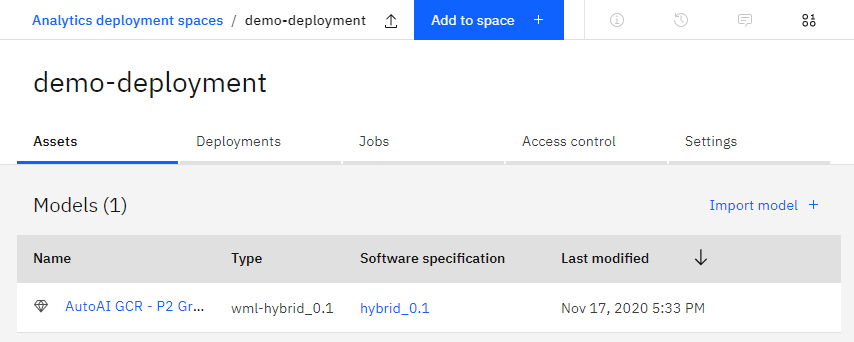

This chapter documents the environment pre-requisites to deploy the artifacts supporting the integration of WML with ODM.

## Environment
In order to run the use case, you will need to have an OpenShift cluster with the following components installed:
- IBM Cloud Pak for Data 3.0.1
- IBM Cloud Pak for Automation version 20.0.2
    - Operational Decision Manager (ODM)
    - Business Automation Insights (BAI)

## Configuration
<InlineNotification kind="warning">
Work in progress
</InlineNotification>

## Deployment

### WML scoring service deployment
In order to run a scoring service from ODM, you need to create and deploy this scoring service to WML. The easiest way to achieve this is to create a service using the AutoAI capability of CP4D, following these steps:

- Open a CP4D project and click the `Add to project` button, then select the `AutoAI experiment` asset type.
- Provide a name for you experiment, e.g. `AutoAI GCR`.
- On the next screen, when prompted for a data source, drag and drop the training data CSV file `gcr-training-data.csv` from the [`ml-training-data`](https://github.com/ibm-cloud-architecture/odm-cp4d-integration/tree/master/data/ml-training-data) folder to the `Add data source` pane. The data is then loaded and the available data columns are displayed.
- In `Select prediction column`, select the `Risk` column. At this point, you should see the following:

- Click the `Run experiment` button. When the generation of alternative pipelines complete, select one of them and click `Save as > Model`, then save the model.

- When prompted by a green message box, click `View in project` and on the model page, click the `Promote to deployment space` link.
- From the main menu (hamburger on the left), you can select `Analytics deployment` then select the deployment space you used to deploy your newly minted scoring model. You should now see something like this:

- Click on your model, then on the next page, click the `Create deployment` button. Select `Online` for the deployment type, provide a name for the deployment and click `Create`. After a while, your scoring service is now deployed as a web service. Click on the service to get the endpoint to execute the scoring.
*Take note of this endpoint* as it is the one that you will provide to the ODM decision service so it can invoke the scoring service.

You can also perform some quick, interactive tests of the scoring service from this page.

### ODM decision services deployment

As mentioned in the use case definition, there are several possible approaches to the design of the object model for the rules. Two decision service archives, a *hierarchical* and *flat* version, are available under the [`exports`](https://github.com/ibm-cloud-architecture/odm-cp4d-integration/tree/master/data/exports) folder.
You can load them in ODM Decision Center by following these steps:
- Open the Decision Center business console and click on the `Library` tab.
- Select the `Import Decision Service` button, navigate to the `dc-export - risk-assessment-main.zip` archive in the `exports` folder and click the `Import` button. Repeat for the same process for the `dc-export - dynamic-risk-assessment-main.zip` archive.
The decision service projects are now loaded:

