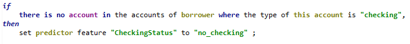

<InlineNotification kind="warning">
<strong>Updated 11/12/2020</strong> - Work in progress
</InlineNotification>

ODM is a flexible and open platform that can easily interface with other applications or services. So, while it does not provide an out-of-the-box capability to connect and invoke a scoring service, you can define this integration through a dedicated XOM and BOM entry, as well as a subflow to prepare the scoring service request payload and process the ML service response.

To review the code artifacts mentioned in this chapter, you should open the projects under the [`hierachical-model`](https://github.com/ibm-cloud-architecture/odm-cp4a-integration/tree/master/hierarchical-model) folder in Rule Studio.

## Defining the scoring service invocation helper

Invocation of the scoring services rely on the [`PredictionServices`](https://github.com/ibm-cloud-architecture/odm-cp4a-integration/blob/master/hierarchical-model/helper-ml-xom/src/com/ibm/odm/ml/PredictionServices.java) Java class, found in the `helper-ml-xom` project. This class and its methods are then made available to the rules by creating the following BOM entry as part of the decision service project:


The steps to use this class are the following:

- You start by creating an instance of `PredictionServices`, providing the WML service endpoint and the associated WML token for authorization. You will probably want to create this instance in the starting node of the ruleflow, as it can be reused all through the rules execution.

- You then define the names of the scoring parameters using the `defineFeature` method, in the order expected by the scoring service.

- You can then set the values for the parameters using the appropriate `addFeature` method depending on whether the type of the feature is an string, an integer, etc..

- At this point, you are ready to invoke the `runSinglePrediction` method, to which you provide the resource for the scoring service, e.g. `/v4/deployments/<wml-service-id>/predictions`, as parameter.
This method takes care of creating the required JSON input payload for the scoring service, calling the service and extracting the prediction from the service response.
The JSON payload returned by the WML scoring service is expected to look like this:
```
{
   "predictions": [{
      "fields": ["prediction", "probability"],
      "values": [["No Risk", [0.7, 0.3]]]
    }]
}
```
Out of this payload, only the `prediction` value as a string is returned by `runSinglePrediction`, in this case `"No Risk"`.

For testing purpose, you can use the `runPredictionService` static method, which executes a scoring services given the full URL of the service, the authentication token and the service input data as a json string. 

## Invoking the scoring service from the rules
You can find the rule artifacts discussed in this section in the `risk-assessment-rules` project, under the `predictive assessment` rule package.
As discussed previously, the invocation from the rules occurs in three steps that you would typically implement as a subflow, similar to the `risk prediction flow`:


Let's review this flow's successive tasks and their rules.

### `init prediction features`
When invoking a scoring service from ODM, we need to bridge two object models: the ODM model, which is usually structured as a hierarchy of concepts and attributes and the ML service input parameters, which is a flat list of attribute values corresponding to the set of features used to train the ML model.

Some attribute values, in particular numbers, are the same on in the ODM world and in the WML world. In this case the initializations of the scoring parameters can be simply done by navigating to the ODM attribute, and assigning its value to the scoring parameter. This is what is done in the following rules:


However, it is often the case that the attribute values that are used in the rules do not correspond to the values used by the scoring model. So before you can call the scoring, you need to perform some mapping of the ODM values to the WML values.

For example, the `CheckingStatus` scoring parameter value needs to be mapped from an account instance of type checking on the ODM side. So, you need to first check whether the borrower has a checking account, and if it's the case, map the balance of that account to the scoring parameter value. This is done respectively with the following two rules:

Action rule `no checking`


Decision table `set checking status`


You can find more example of mapping rules under the `init prediction features` package.

### `run prediction`
Once the value mapping is done and all scoring parameter values have been accumulated by the `PredictionServices` instance, you just have to call the scoring service method from a rule like the one below, which uses the verbalized form of the `runSinglePrediction` method to runs the `risk scoring` service and sets the output value to a temprary ODM variable. 


### `set prediction result`
This final step maps the score from WML to the corresponding ODM attribute value. At this point, the scoring operation is complete and the rest of the ODM rules can continue to execute.


