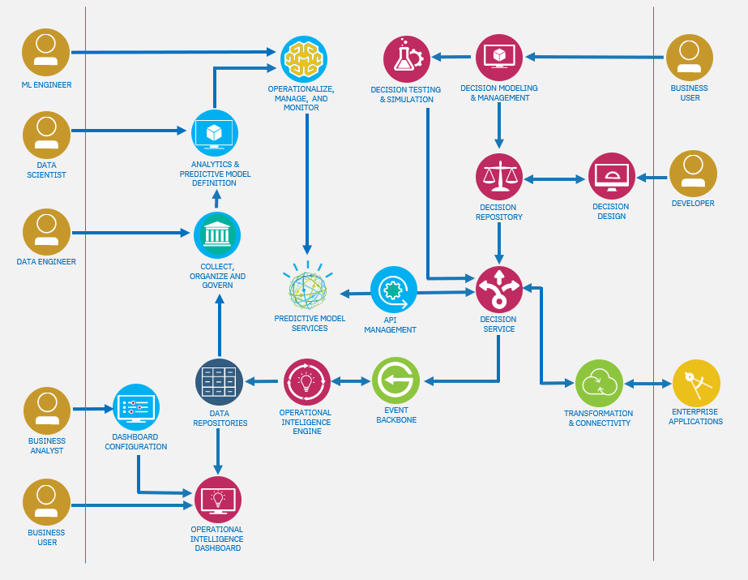

<InlineNotification kind="warning">
<strong>Updated 11/09/2020</strong> - Work in progress
</InlineNotification>

This repository addresses different aspects around the integration of rule-based decision services with machine learning-based scoring services. More specifically, it presents the integration of Operational Decision Manager (ODM), from the Cloud Pak for Automation, with Watson ML (WML), from the Cloud Pack for Data (CP4D).

It illustrates non-functional architecture details such as security and performance, as well as functional topics such as best practices for WML service invocation from ODM, or making choices in the design of the ODM execution and business object model. For each topic, we try as much as possible to provide you with the code as well as detailed steps to exercise the code or process for yourself.

This is what to expect from each sections:

- The *Use case* section introduces the example that we are using throughout the different sections.

- *Configuration* goes through install steps for ODM and Business Automation Insights (BAI) and addresses non-functional questions such as scaling and security.

- *Integration* proposes a model and implementation to set up the invocation of WML services from ODM.

- *Champion-Challenger* presents how you can implement this type of deployment strategy in ODM with the use of the BAI component.

- *Simulation* describes how to create a scenario provider to execute simulations in Decision Center using an external source of data for the simulation scenarios, and also how to execute simulations on a Spark grid from a Jupyter notebook in Watson Studio, allowing extreme parallelisation of simulation execution.

- Finally, *CI/CD with ODM* describes how you can integrate the ODM decision services lifecycle in your CI/CD pipeline.

The figure below provides a high-level view of the different components of CP4D, ODM and BAI working together. We will reuse part of this architecture diagram in the rest of this documentation. You can find more information about the Cloud Pak for Data and Cloud Pak for Automation architectures in the [IBM Architecture Center](https://www.ibm.com/cloud/architecture/).

Use the following links to access the documentation for the different components used in this repository:
- [Cloud Pak for Automation](https://www.ibm.com/support/knowledgecenter/SSYHZ8_20.0.x/welcome/kc_welcome_dba_distrib.html)
- [Cloud Pak for Data](https://www.ibm.com/support/knowledgecenter/en/SSQNUZ_3.0.1/cpd/overview/welcome.html)
- [Operational Decision Manager](https://www.ibm.com/support/knowledgecenter/SSYHZ8_20.0.x/com.ibm.dba.offerings/topics/con_odm_prod.html)
- [Business Automation Insights](https://www.ibm.com/support/knowledgecenter/SSYHZ8_20.0.x/com.ibm.dba.bai/topics/con_bai_overview_top.html)

Before we dive into ote that the Automation Decision Services (ADS) platform

---

This repository is part of a larger collection of Digital Business Automation [best practices and reusable content](https://ibm-cloud-architecture.github.io/refarch-dba/introduction/overview/) for deploying solutions using IBM Cloud Pak for Automation components.
