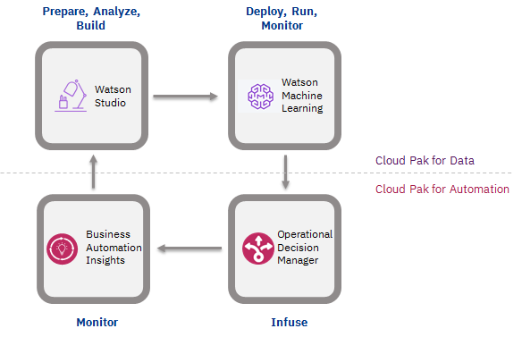

The goal of this use case is to explore different aspects of the integration of rule-based decision services with machine learning-based scoring services. More specifically, it presents the integration of Operational Decision Manager (ODM) and Business Automation Insights (BAI), which are part of the IBM Cloud Pak for Automation, with Watson Studio and Watson Machine Learning (WML), part of the IBM Cloud Pak for Data (CP4D).

While we document some non-functional architecture details such as security and performance, the main focus is on functional topics such as building a pattern to invoke a WML service from ODM, or presenting design options for the ODM execution and business object model. For each topic, we try as much as possible to provide you with a working implementation, as well as detailed steps to exercise the code for yourself, assuming you are familiar with the ODM platform.

This is a summary of what you will find in each section:

- **Use case** introduces the working example that we are using throughout the different sections.

- **Solution deployment** goes through the required environment to support the solution, details about install, scaling and security, and how to deploy the different solution artifacts.

- **ODM-WML integration** proposes a model and implementation to set up the invocation of WML services from ODM.

- **Champion-challenger with BAI** presents how you can implement this type of deployment strategy in ODM with the use of the BAI component.

- **Large scale simulation** describes how to create a scenario provider to execute simulations in Decision Center using an external source of data for the simulation scenarios, and also how to execute simulations on a Spark grid from a Jupyter notebook in Watson Studio, allowing extreme parallelisation of simulation execution.

- **CI/CD with ODM** describes how you can integrate the ODM decision services lifecycle in your CI/CD pipeline.

## Component view

The figure below provides a high-level view of the different components of CP4D, ODM and BAI working together. We will reuse part of this architecture diagram in the rest of this documentation. You can find more information about the Cloud Pak for Data and Cloud Pak for Automation architectures in the [IBM Architecture Center](https://www.ibm.com/cloud/architecture/).

Use the following links to access the documentation for the different components used in this repository:
- [Cloud Pak for Automation](https://www.ibm.com/support/knowledgecenter/SSYHZ8_20.0.x/welcome/kc_welcome_dba_distrib.html)
- [Cloud Pak for Data](https://www.ibm.com/support/knowledgecenter/en/SSQNUZ_3.0.1/cpd/overview/welcome.html)
- [Operational Decision Manager](https://www.ibm.com/support/knowledgecenter/SSYHZ8_20.0.x/com.ibm.dba.offerings/topics/con_odm_prod.html)
- [Business Automation Insights](https://www.ibm.com/support/knowledgecenter/SSYHZ8_20.0.x/com.ibm.dba.bai/topics/con_bai_overview_top.html)

---

This repository is part of a larger collection of Digital Business Automation [best practices and reusable content](https://ibm-cloud-architecture.github.io/refarch-dba/introduction/overview/) for deploying solutions using IBM Cloud Pak for Automation components.
