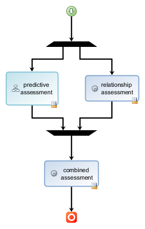
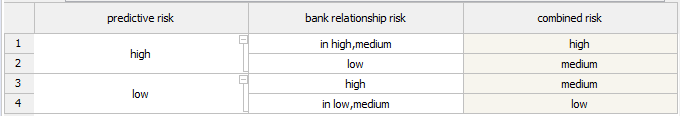
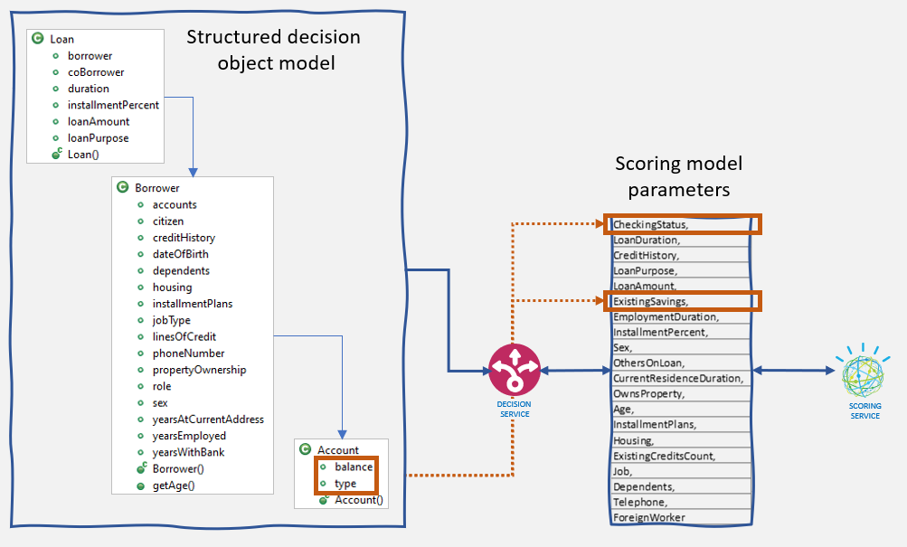
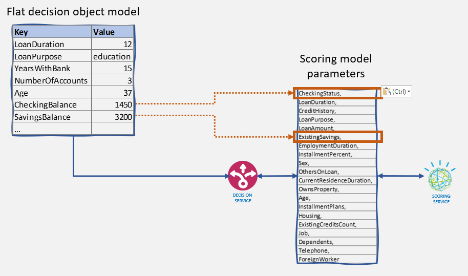

Running ML-based scoring models as part of a rule-based decision service is a widespread need. It is almost always a requirement for solutions that involve activities such as:
- Evaluating risk for underwriting a contract
- Assessing fraud potential for a financial transaction or claim.

The business scenario underlying the code provided in this repository is about evaluating a bank credit risk. The goal is to show how to combine the Operational Decision Manager (ODM) component from the IBM Cloud Pak for Automation with the IBM Cloud Pak for Data platform to create, simulate, manage, and operationalize a loan risk evaluation decision service. This service uses:

- A predictive scoring component that relies on a ML model for loan default. The basis we are using for this component is the well-know [German Credit Risk](https://archive.ics.uci.edu/ml/datasets/statlog+(german+credit+data)) classification data. The training data for the model can be found in [this CSV file](https://github.com/ibm-cloud-architecture/odm-cp4a-integration/blob/master/data/ml-training-data/gcr-training-data.csv).

- A set of explicit business rules based on established company policies to compound the raw outcome of the predictive model with e.g. banking relationship-based factors. For example, the bank may want to explicitly favor employees of the bank and their family and pre-emptively reduce their risk score.

The basic decision flow is the following:

The combined assessment step is using a simple decision table to combine the two components of the risk evaluation:

## ODM object model

### Hierarchical model

Object models designed to support rule-based decisions are usually structured as a hierarchy of concepts to reflect the richness and complexity of the business entities that participate in a decision. For our use case, one version of the object model uses the nested Loan, Borrower and Account classes shown on the figure below.

Note that ML-based scoring services are usually taking in as parameters a flat list of values that corresponds to the features used to train the model.
To invoke the scoring service, the decision service collects and maps the required scoring parameters from the ODM object model into a flat parameter list.

You can explore the object model and the rules for this model by loading the projects under the [hierarchical-model](https://github.com/ibm-cloud-architecture/odm-cp4a-integration/tree/master/hierarchical-model) folder in Rule Designer.

Alternatively, you can upload this decision service [archive](https://github.com/ibm-cloud-architecture/odm-cp4a-integration/blob/master/data/exports/dc-export%20-%20risk-assessment-main.zip) in Decision Center.

### Flat model

The benefit of structured object models is that they allow to take into account all the details of the context of data needed to make complex business decisions. The flipside is that they create a rigid service contract. Adding a new data element to the object model requires changes to the supporting execution object model (Java classes), which requires intervention from IT resources.

This is unlike the scoring services, for which adding a new parameter value for a new feature of the ML model is straightforward. So, if your decision services are using a context of data that is at the same level as the one used for the scoring services, and you need to have similar flexibility and dynamicity for your decision services as your scoring services, you should consider using a flat model for ODM.
For our use case, a flat model looks like the following:

This design uses a collection of key-value pairs and thus does not have to change if you need to add a new data element for the rules. This means that you can easily evolve your ML model by changing the set of features and adjust accordingly decision service parameters. The decision service is now as dynamic as the scoring service.

The flat model is also helpful to instrument the execution of simulations, either through a custom scenario provider, as the provider implementation does not need to change when the object model evolves, or for large scale simulations, through embedded execution on a Spark grid. See the Simulation chapter for more details about this.

Of course, there's a flipside too to this flat model. Multi-valued attributes become more difficult to manage. Different attributes with the same name also need to be artificially renamed to be differentiated. So, as usual in the design of an object model, there is not a good or a bad model, but one that is more or less appropriate for the task at hand.

You can explore the flat object model implementation by loading the projects under the [flat-model](https://github.com/ibm-cloud-architecture/odm-cp4a-integration/tree/master/flat-model) folder in Rule Designer.

Alternatively, you can upload this decision service [archive](https://github.com/ibm-cloud-architecture/odm-cp4a-integration/blob/master/data/exports/dc-export%20-%20dynamic-risk-assessment-main.zip) in Decision Center.

